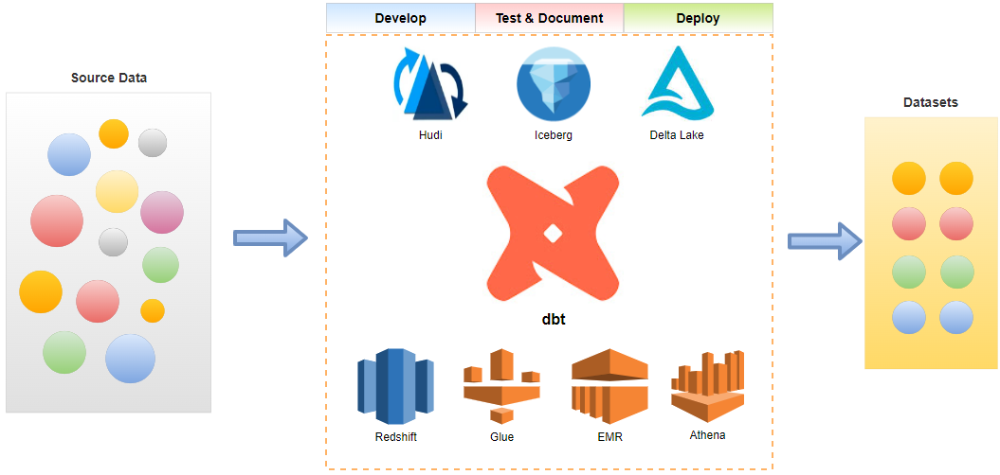

# dbt on AWS

- Part 1 - Redshift
  - The [data build tool (dbt)](https://docs.getdbt.com/docs/introduction) is an effective data transformation tool and it supports key AWS analytics services - Redshift, Glue, EMR and Athena. In part 1 of the dbt on AWS series, we discuss data transformation pipelines using dbt on [Redshift Serverless](https://aws.amazon.com/redshift/redshift-serverless/). [Subsets of IMDb data](https://www.imdb.com/interfaces/) are used as source and data models are developed in multiple layers according to the [dbt best practices](https://docs.getdbt.com/guides/best-practices/how-we-structure/1-guide-overview).
  - [dbt source](./redshift-sls)
- More examples to come
