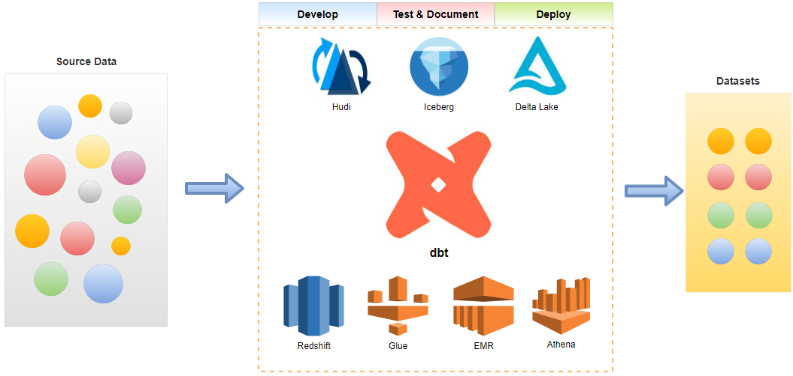

# dbt on AWS

The [data build tool (dbt)](https://docs.getdbt.com/docs/introduction) does the transform step of ELT, and it has adapters for four AWS analytics services: Redshift, Glue, EMR and Athena. This repository holds five dbt projects that build the same IMDb data models on each of those services, with the Terraform that creates the AWS resources for each one. The model set is identical in all five folders, so each folder README states what its own path differs in: the adapter, how the connection is made, and where the data is stored.

Every folder deploys real AWS resources and they cost money while they exist. Each folder README ends with the `terraform -chdir=infra destroy` command that removes them.

## Folders

| Folder | Adapter | Connection | Storage | Post |
| --- | --- | --- | --- | --- |
| [redshift-sls](./redshift-sls/) | `dbt-redshift` | Redshift Serverless workgroup in a private subnet, reached over a SoftEther VPN | Native Redshift tables, loaded by `COPY` from S3 | [Data Build Tool (dbt) for Effective Data Transformation on AWS – Part 1 Redshift](https://jaehyeon.me/blog/2022-09-28-dbt-on-aws-part-1-redshift/) |
| [glue](./glue/) | `dbt-glue` | Glue interactive session assumed through an IAM role, started by dbt | Parquet on S3 in the Glue Data Catalog, sources built by Glue crawlers | [Data Build Tool (dbt) for Effective Data Transformation on AWS – Part 2 Glue](https://jaehyeon.me/blog/2022-10-09-dbt-on-aws-part-2-glue/) |
| [emr-ec2](./emr-ec2/) | `dbt-spark` | Spark Thrift Server started as an EMR step, reached over a SoftEther VPN | Parquet on S3 in the Glue Data Catalog, sources built by `dbt_external_tables` | [Data Build Tool (dbt) for Effective Data Transformation on AWS – Part 3 EMR on EC2](https://jaehyeon.me/blog/2022-10-19-dbt-on-aws-part-3-emr-ec2/) |
| [emr-eks](./emr-eks/) | `dbt-spark` | Spark Thrift Server run as an EMR on EKS job, exposed by a Kubernetes service | Parquet on S3 in the Glue Data Catalog, sources built by `dbt_external_tables` | [Data Build Tool (dbt) for Effective Data Transformation on AWS – Part 4 EMR on EKS](https://jaehyeon.me/blog/2022-11-01-dbt-on-aws-part-4-emr-eks/) |
| [athena](./athena/) | `dbt-athena-adapter` | Athena workgroup over the AWS API, no cluster and no VPN | Parquet on S3 in the Glue Data Catalog, sources built by Glue crawlers | [Data Build Tool (dbt) for Effective Data Transformation on AWS – Part 5 Athena](https://jaehyeon.me/blog/2022-12-06-dbt-on-aws-part-5-athena/) |

## Motivation

In our experience delivering data solutions for our customers, we have observed a desire to move away from a centralised team function, responsible for the data collection, analysis and reporting, towards shifting this responsibility to an organisation’s lines of business (LOB) teams. The key driver for this comes from the recognition that LOBs retain the deep data knowledge and business understanding for their respective data domain; which improves the speed with which these teams can develop data solutions and gain customer insights. This shift away from centralised data engineering to LOBs exposed a skills and tooling gap.

Let’s assume as a starting point that the central data engineering team has chosen a project that migrates an on-premise data warehouse into a data lake (spark + iceberg + redshift) on AWS, to provide a cost-effective way to serve data consumers thanks to iceberg’s ACID transaction features. The LOB data engineers are new to spark and they have a little bit of experience in python while the majority of their work is based on SQL. Thanks to their expertise in SQL, however, they are able to get started building data transformation logic on jupyter notebooks using pyspark. However they soon find the codebase gets quite bigger even during the minimum valuable product (MVP) phase, which would only amplify the issue as they extend it to cover the entire data warehouse. Additionally the use of notebooks makes development challenging mainly due to lack of modularity and failing to incorporate testing. Upon contacting the central data engineering team for assistance they are advised that the team uses scala and many other tools (e.g. Metorikku) that are successful for them, however cannot be used directly by the engineers of the LOB. Moreover the engineering team don’t even have a suitable data transformation framework that supports iceberg. The LOB data engineering team understand that the data democratisation plan of the enterprise can be more effective if there is a tool or framework that:

- can be shared across LOBs although they can have different technology stack and practices,
- fits into various project types from traditional data warehousing to data lakehouse projects, and
- supports more than a notebook environment by facilitating code modularity and incorporating testing.

The [data build tool (dbt)](https://docs.getdbt.com/docs/introduction) is an open-source command line tool and it does the T in ELT (Extract, Load, Transform) processes well. It supports a wide range of [data platforms](https://docs.getdbt.com/docs/supported-data-platforms) and the following key AWS analytics services are covered – Redshift, Glue, EMR and Athena. It is one of the most popular tools in the [modern data stack](https://www.getdbt.com/blog/future-of-the-modern-data-stack/) that originally covers data warehousing projects. Its scope is extended to data lake projects by the addition of the [dbt-spark](https://github.com/dbt-labs/dbt-spark) and [dbt-glue](https://github.com/aws-samples/dbt-glue) adapter where we can develop data lakes with spark SQL. Recently the spark adapter added open source table formats (hudi, iceberg and delta lake) as the supported file formats and it allows you to work on data lake house projects with it. As discussed in this [blog post](https://towardsdatascience.com/modern-data-stack-which-place-for-spark-8e10365a8772), dbt has clear advantages compared to spark in terms of

- low learning curve as SQL is easier than spark
- better code organisation as there is no correct way of organising transformation pipeline with spark

On the other hand, its weaknesses are

- lack of expressiveness as [Jinja](https://docs.getdbt.com/docs/building-a-dbt-project/jinja-macros) is quite heavy and verbose, not very readable, and unit-testing is rather tedious
- limitation of SQL as some logic is much easier to implement with user defined functions rather than SQL

Those weaknesses can be overcome by [Python models](https://docs.getdbt.com/docs/building-a-dbt-project/building-models/python-models) as it allows you to apply transformations as DataFrame operations. Unfortunately the beta feature is not available on any of the AWS services, however it is available on Snowflake, Databricks and BigQuery. Hopefully we can use this feature on Redshift, Glue and EMR in the near future.

Finally the following areas are supported by spark, however not supported by DBT:

- E and L of ELT processes
- real time data processing

Overall dbt can be used as an effective tool for data transformation in a wide range of data projects from data warehousing to data lake to data lakehouse. Also it can be more powerful with spark by its Python models feature.

## License

This repository is released under the MIT License. See [LICENSE](./LICENSE).

`emr-eks/hive-on-spark-in-kubernetes` is an exception. It was adapted from [hive-on-spark-in-kubernetes](https://github.com/mykidong/hive-on-spark-in-kubernetes) by Kidong Lee, described in the article [Hive on Spark in Kubernetes](https://itnext.io/hive-on-spark-in-kubernetes-115c8e9fa5c1) that part 4 links. Only the `SparkThriftServerRunner` wrapper class and its POM were taken, with the dependency scopes changed. That folder carries no licence file of its own, and GitHub currently blocks access to the upstream repository, so its terms could not be checked. The MIT licence above does not cover that folder.
